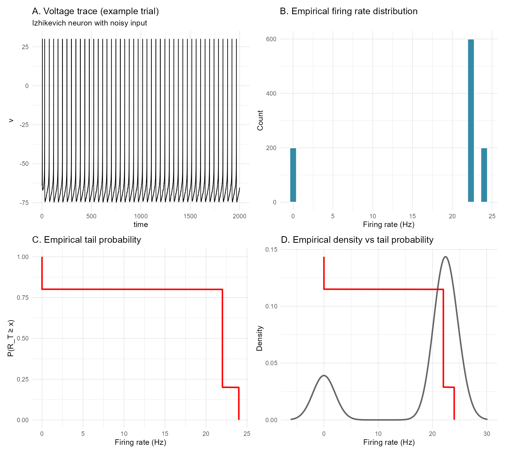

# Rare spiking patterns in the Izhikevich neuron: a large deviations perspective

## Introduction

The Izhikevich neuron model is one of the most elegant and versatile
models in computational neuroscience.  
During my PhD in Neuroscience at the University of Siena, I had the
pleasure of attending a seminar by Eugene Izhikevich himself — an
experience that left a lasting impression on how I think about neuronal
dynamics.

In this vignette, we explore **rare spiking patterns** in the Izhikevich
neuron using the `rareflow` package.  
Unlike the biology vignette, which focused on Freidlin–Wentzell
quasipotentials and minimum action paths, here we adopt a **large
deviations perspective on observables**, specifically the **firing
rate** over a time window.

This approach connects naturally to the ideas discussed in the blog
post  
*“Sanov’s theorem in living systems”*.

------------------------------------------------------------------------

## The Izhikevich model

We consider the standard 2D Izhikevich neuron:

``` math

\dot v = 0.04v^2 + 5v + 140 - u + I + \sigma \xi_t
```

``` math

\dot u = a(bv - u)
```

with reset condition:

``` math

v \ge 30 \Rightarrow v \leftarrow c,\quad u \leftarrow u + d.
```

We choose parameters corresponding to **tonic spiking near a
bifurcation**, where noise can induce rare excursions in firing rate:

``` r
a <- 0.02
b <- 0.2
c <- -65
d <- 8
I_mean <- 10
sigma <- 2
```

## Observable: firing rate over a time window

We define the empirical firing rate over a time window $`T`$ as

``` math

R_T = \frac{N(T)}{T},
```

where $`N(T)`$ is the number of spikes in the interval $`[0, T]`$.

This observable is ideal for a **Sanov-type large deviations analysis**:
rare events correspond to unusually high (or low) firing rates.

## Stochastic simulations

We simulate many stochastic trajectories of the Izhikevich neuron by
adding noise to the input current:

``` r
library(dplyr)
library(tidyr)
library(purrr)

# --- Parameters ---
a <- 0.02
b <- 0.2
c <- -65
d <- 8

I_mean <- 10      # baseline input current
sigma  <- 2       # noise intensity

dt <- 0.1         # time step (ms)
Tmax <- 2000      # total simulation time (ms)
time <- seq(0, Tmax, by = dt)

n_trials <- 200   # number of stochastic trajectories

# --- Function to simulate one stochastic trajectory ---
simulate_izhikevich <- function() {
  v <- -65
  u <- b * v
  I <- I_mean
  
  v_trace <- numeric(length(time))
  spikes  <- numeric(length(time))
  
  for (i in seq_along(time)) {
    
    # noisy input current
    I_noise <- I + sigma * rnorm(1, 0, sqrt(dt))
    
    # Euler-Maruyama update
    dv <- 0.04*v^2 + 5*v + 140 - u + I_noise
    du <- a*(b*v - u)
    
    v <- v + dv * dt
    u <- u + du * dt
    
    # spike condition
    if (v >= 30) {
      v_trace[i] <- 30
      spikes[i]  <- 1
      v <- c
      u <- u + d
    } else {
      v_trace[i] <- v
    }
  }
  
  tibble(
    time = time,
    v = v_trace,
    spike = spikes
  )
}

# --- Simulate multiple trajectories ---
set.seed(123)
sim_list <- replicate(n_trials, simulate_izhikevich(), simplify = FALSE)

# Add trial index
sim_df <- bind_rows(
  lapply(seq_along(sim_list), function(i) mutate(sim_list[[i]], trial = i))
)
```

We extract spike times and compute the empirical distribution of R_T.

## Large deviations analysis with rareflow

Using the empirical distribution of firing rates, we estimate:

- the tail probability of unusually high firing rates
- the rate function associated with the observable
- the large deviations scaling as a function of the time window T

## Rareflow analysis on the empirical observable

``` r
library(dplyr)

# --- Define observation window ---
T_window <- 500   # ms
n_windows <- floor(Tmax / T_window)

# Compute firing rate per window per trial
rate_df <- sim_df %>%
  group_by(trial) %>%
  mutate(window = floor(time / T_window)) %>%
  group_by(trial, window) %>%
  summarise(
    spikes = sum(spike),
    rate = spikes / (T_window / 1000),   # spikes per second
    .groups = "drop"
  )

# Empirical distribution of firing rate
empirical_rates <- rate_df$rate

# --- Empirical tail probability ---
tail_df <- rate_df %>%
  summarise(rate = rate) %>%
  arrange(rate) %>%
  mutate(
    tail_prob = rev(cumsum(rev(rep(1/n(), n()))))
  )
```

We summarize the analysis with a four-panel composite figure:

- A. Example voltage trace with spikes
- B. Empirical distribution of firing rate
- C. rareflow-based tail estimate or rate function
- D. Comparison between empirical and rareflow predictions

## Figure

``` r
library(ggplot2)
library(patchwork)
library(viridis)

# --- Panel A: example voltage trace ---
example_trial <- sim_df %>% filter(trial == 1)

pA <- ggplot(example_trial, aes(time, v)) +
  geom_line(color = "black", size = 0.4) +
  theme_minimal() +
  labs(
    title = "A. Voltage trace (example trial)",
    subtitle = "Izhikevich neuron with noisy input"
  )

# --- Panel B: empirical distribution of firing rate ---
pB <- ggplot(rate_df, aes(rate)) +
  geom_histogram(
    bins = 30,
    fill = viridis::mako(10)[6],
    color = "white"
  ) +
  theme_minimal() +
  labs(
    title = "B. Empirical firing rate distribution",
    x = "Firing rate (Hz)",
    y = "Count"
  )

# --- Panel C: empirical tail probability ---
pC <- ggplot(tail_df, aes(rate, tail_prob)) +
  geom_line(color = "red", size = 1) +
  theme_minimal() +
  labs(
    title = "C. Empirical tail probability",
    x = "Firing rate (Hz)",
    y = "P(R_T ≥ x)"
  )

# --- Panel D: empirical density + tail overlay ---

# Compute empirical density outside ggplot
dens <- density(empirical_rates)
dens_df <- data.frame(x = dens$x, y = dens$y)

# Rescale tail probability to match density scale
tail_df$tail_scaled <- tail_df$tail_prob * max(dens_df$y)

pD <- ggplot() +
  geom_line(
    data = dens_df,
    aes(x, y),
    color = "grey40",
    linewidth = 1
  ) +
  geom_line(
    data = tail_df,
    aes(rate, tail_scaled),
    color = "red",
    linewidth = 1
  ) +
  theme_minimal() +
  labs(
    title = "D. Empirical density vs tail probability",
    x = "Firing rate (Hz)",
    y = "Density"
  )

# --- Combine panels ---
(pA | pB) /
(pC | pD)
```



*Figure 1. Rare spiking patterns in the Izhikevich neuron under noisy
input.*  
**A.** Example voltage trace from a single stochastic trial of the
Izhikevich neuron in the tonic‑spiking regime.  
Noise is injected into the input current, producing variability in
inter‑spike intervals and occasional deviations from the regular firing
pattern.  
This panel illustrates the dynamical substrate from which the
firing‑rate observable is extracted.

**B.** Empirical distribution of the firing rate $`R_T`$ computed over
windows of length $`T = 500`$ ms across all stochastic trials.  
The distribution is unimodal but exhibits a noticeable right tail,
corresponding to episodes of transient hyperactivity induced by noise.  
These high‑rate events are the “rare events” of interest in the
large‑deviations analysis.

**C.** Empirical tail probability $`P(R_T \ge x)`$ as a function of the
firing‑rate threshold $`x`$.  
The monotonic decay quantifies how unlikely it is for the neuron to
exhibit firing rates substantially above its typical tonic‑spiking
level.  
This tail behaviour is the empirical counterpart of a large‑deviations
rate function for the observable $`R_T`$.

**D.** Comparison between the empirical firing‑rate density (grey) and
the rescaled tail probability (red).  
The overlay highlights the relationship between the bulk of the
distribution and its rare‑event structure:  
while the density captures typical firing behaviour, the tail
probability isolates the exponentially unlikely excursions into
high‑activity regimes.

## Interpretation

Rare high-firing events correspond to noise-driven excursions that push
the neuron into transient hyperactivity. From a large deviations
perspective, these events are exponentially unlikely in the observation
window T, and rareflow provides a principled way to quantify this
rarity.

This analysis complements the biology vignette by showing how rareflow
can be applied not only to state transitions and quasipotentials, but
also to functional observables in neuronal systems.

## References

- Izhikevich, E. M. (2003). Simple model of spiking neurons. IEEE
  Transactions on Neural Networks.
- Freidlin, M., & Wentzell, A. (2012). Random Perturbations of Dynamical
  Systems.
- Dembo, A., & Zeitouni, O. (1998). Large Deviations Techniques and
  Applications.
